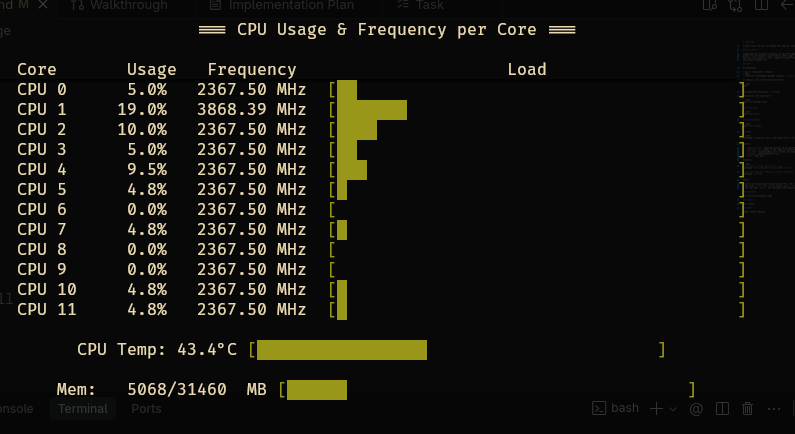

# coreusage

A small Linux CLI tool to display CPU usage per core, frequency, and memory usage.

## Description

Lightweight CLI program to display current CPU usage and clock frequency per core, including bar graphs. It also monitors system memory (RAM) usage.
The tool runs cleanly in TTYs, supports flicker-free rendering, and provides meaningful output even when piped (without TTY).

## Build

Prerequisites:

- GCC or compatible C compiler
- Make
- libsensors development package (usually `lm_sensors` or `libsensors-dev`)

To compile, run in the project directory:

```bash
make
```

This generates the binary: `coreusage`

Debug build with sanitizers:

```bash
make clean && make debug
```
## Archlinux:

There is "coreusage-git" in the AUR !

## Installation

```bash
sudo make install
```

## Uninstallation

```bash
sudo make uninstall
```

## Usage

```bash
coreusage [--interval <ms>] [--bar-width <n>] [--no-color] [--no-temp] [--help]
```

Options:

- `--interval <ms>`: Sampling interval in milliseconds (Default: 200)
- `--bar-width <n>`: Width of the usage bar (Default: 40)
- `--no-color`: Disable ANSI colors (useful for pipes/logs)
- `--no-temp`: Hide temperature line
- `--help`: Show help

Examples:

```bash
# Wider bars, faster interval, no color
coreusage --bar-width 60 --interval 150 --no-color

# Only CPU usage and frequency, without temperature line
coreusage --no-temp
```

Notes:

- Colors are automatically used only on TTYs; use `--no-color` to force disable them.
- Exit with `q` or `ESC`, or via signals (e.g., `Ctrl+C`).
- The tool uses `poll()` for efficient input handling and minimal CPU overhead.

## Screenshot



## License

MIT License

## Author

(2025) Lennart Martens
