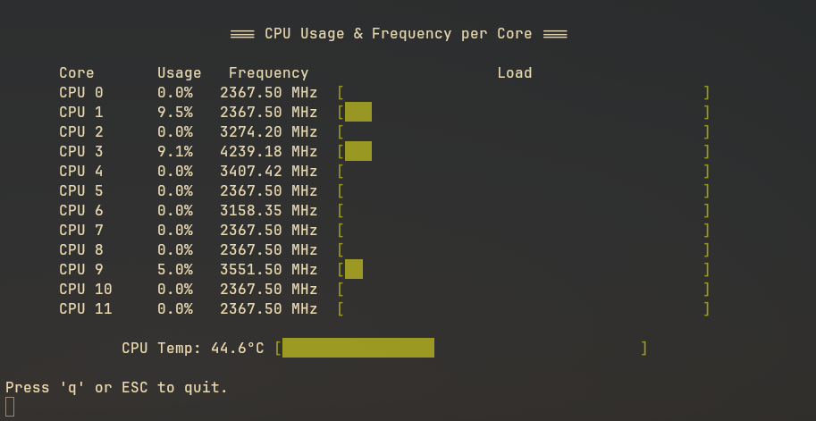

# coreusage

Ein kleines Linux-CLI-Tool zur Anzeige der CPU-Auslastung je Kern.

## Beschreibung

Leichtgewichtiges CLI-Programm zur Anzeige der aktuellen CPU-Auslastung und Taktfrequenz pro Kern inklusive Balkengrafik. Läuft sauber in TTYs und gibt sinnvolle Ausgabe auch als Pipe (ohne TTY) aus.

## Build

Voraussetzungen:

- GCC oder kompatibler C-Compiler
- Make
- libsensors-Entwicklerpaket (üblicherweise `lm_sensors` oder `libsensors-dev`)

To compile, run in the project directory:

```bash
make
```

Das erzeugt das Binary: `coreusage`

Debug-Build mit Sanitizern:

```bash
make clean && make debug
```

## Installation

```bash
sudo make install
```

## Deinstallation

```bash
sudo make uninstall
```

## Verwendung

```bash
coreusage [--interval <ms>] [--bar-width <n>] [--no-color] [--no-temp] [--help]
```

Optionen:

- `--interval <ms>`: Abtastintervall in Millisekunden (Standard: 200)
- `--bar-width <n>`: Breite des Auslastungsbalkens (Standard: 40)
- `--no-color`: ANSI-Farben deaktivieren (nützlich für Pipes/Logs)
- `--no-temp`: Temperaturzeile ausblenden
- `--help`: Hilfe anzeigen

Beispiele:

```bash
# Breitere Balken, schnelleres Intervall, ohne Farbe
coreusage --bar-width 60 --interval 150 --no-color

# Nur CPU-Auslastung und Frequenz, ohne Temperaturzeile
coreusage --no-temp
```

Hinweise:

- Farben werden automatisch nur auf TTYs genutzt; mit `--no-color` lassen sie sich erzwingen deaktivieren.
- Beenden mit Taste `q` oder `ESC` sowie via Signalen (z. B. `Ctrl+C`).

## Screenshot



## Lizenz

MIT-Lizenz

## Autor

(2025) Lennart Martens
